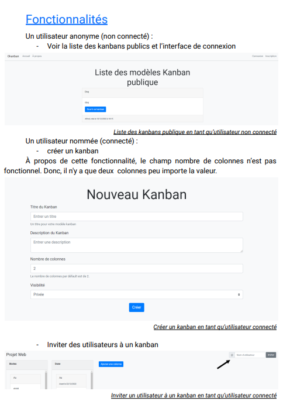
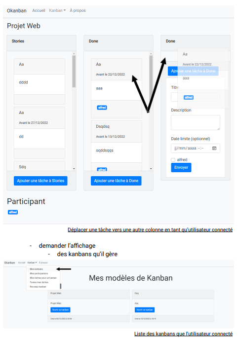
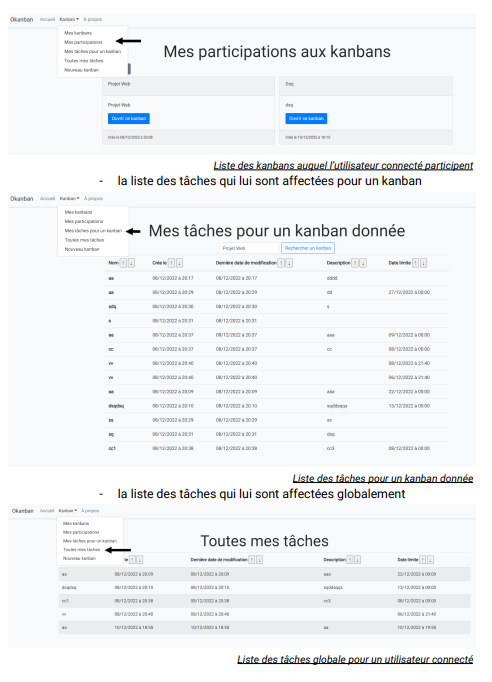

# Okanban

Ce projet est un gestionnaire de kanbans en ligne.

# Visualisation

 
 

## W3C Validator
Toutes les pages ont été validés sur W3C Validator.
Lien : ```https://validator.w3.org/```

## Outils :
- ```PHP 7.3```
- ```Bootsrap v4.1```
- ```MySQL```

## Configuration de la base de données
Il faut créer la base de données dans phpmyadmin.
Cette base de données doit s'appeler ```okanban```.
Ensuite, sélectionner la base de données et importer le fichier ```okanban.sql```.
Le fichier ```okanban.sql``` va créer toutes les tables.

Après, afin de paramètrer l'accès à la base de données, il faut modifier le fichier ```/src/database/.env```
Si celui-ci n'existe pas, alors vous devez le créer dont voici un exemple ci-dessous :
```/src/database/.env```
```
DATABASE_SERVERNAME=localhost
DATABASE_NAME=okanban
DATABASE_USER=root
DATABASE_PASSWORD=mot_de_passe
```
## Redirection URL
Afin que la redirection d'URL soit fonctionnelle, il doit y avoir deux fichiers .htaccess.
Si ceux-là ne sont pas présents, vous devez les créer.

Ce .htaccess se trouve à la racine du projet.
```./.htaccess```
```
RewriteEngine on
RewriteRule ^$ ./public [L]
```

Ce .htaccess se trouve dans le répertoire public.
```/public/.htaccess```
```
# Activation de la réécriture d'URL
RewriteEngine on
#--------------------------------------------------
# Règles de réécriture d'URL :
#--------------------------------------------------
RewriteCond %{REQUEST_FILENAME} !-d
RewriteCond %{REQUEST_FILENAME} !-f
RewriteRule ^(.*)$ ./index.php?url=$1 [QSA,L]
```

## Visualisation du modèle conceptuel de données
Importer le fichier ```okanban_mcd.drawio``` à cette adresse : ```https://app.diagrams.net/```

### Note :
Afin de tester ce projet, j'ai utilisé une machine virtuelle qui elle même utilise une machine virtuelle. 
Pour pouvoir exécuter, une machine virtuelle dans une machine virtuelle, il faut :
```Configuration -> Système -> Processeur -> Activer VT-x```


